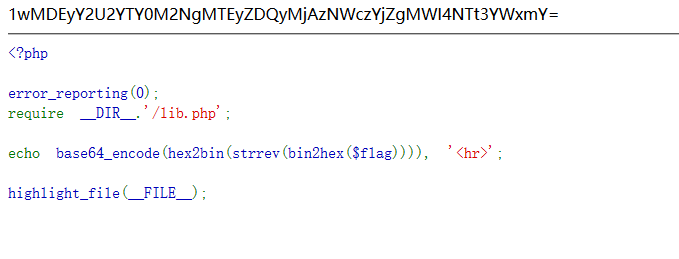

## 【步骤】

**注：** 这里环境里的flag是自己输入的随机字符，所以不用考虑最后flag和答案不一致的问题

1.打开自己电脑中的浏览器，访问靶机开放的环境地址`http://IP:PORT/`来进行访问实验环境



2.题目给出字符串:`1wMDEyY2U2YTY0M2NgMTEyZDQyMjAzNWczYjZgMWI4NTt3YWxmY=`和相关字符串加密代码,我们反解一下即可。

3.解密函数方法：

```php
<?php
$str = "1wMDEyY2U2YTY0M2NgMTEyZDQyMjAzNWczYjZgMWI4NTt3YWxmY=";
echo hex2bin(strrev(bin2hex(base64_decode($str))));
?>
```

4.解密得到flag:


