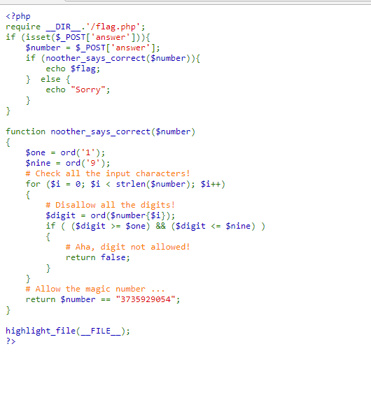
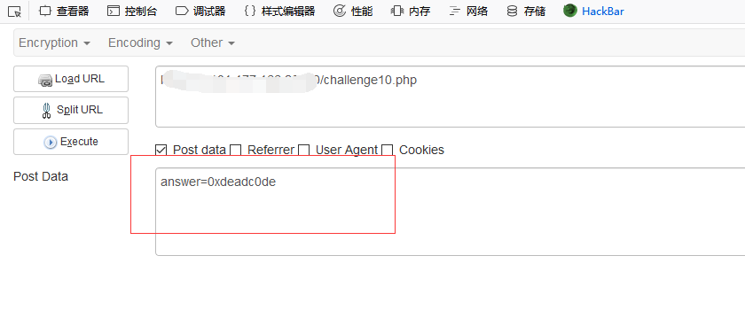
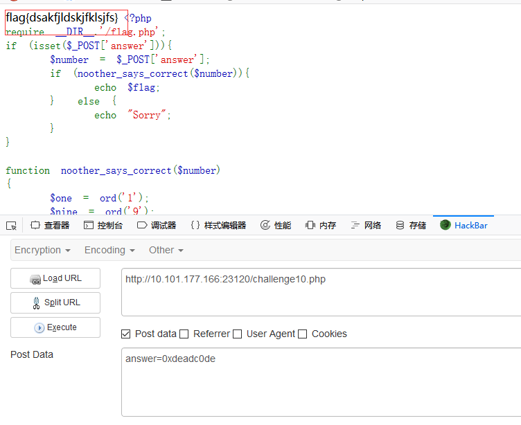

## 【题解】

**注：** 这里环境里的flag是自己输入的随机字符，所以不用考虑最后flag和答案不一致的问题

1.打开自己电脑中的浏览器，访问靶机开放的环境地址`http://IP:PORT/`来进行访问实验环境



2.我们可以直接看到php主要的逻辑代码：

```php
<?php
require __DIR__.'/flag.php';
if (isset($_POST['answer'])){
    $number = $_POST['answer'];
    if (noother_says_correct($number)){
        echo $flag;
    }  else {
        echo "Sorry";
    }
}

function noother_says_correct($number)
{
    $one = ord('1');
    $nine = ord('9');
    # Check all the input characters!
    for ($i = 0; $i < strlen($number); $i++)
    {
        # Disallow all the digits!
        $digit = ord($number{$i});
        if ( ($digit >= $one) && ($digit <= $nine) )
        {
            # Aha, digit not allowed!
            return false;
        }
    }
    # Allow the magic number ...
    return $number == "3735929054";
}

highlight_file(__FILE__);
?>
```

3.我们可以看到题目要求我们传入的每一位不允许是1到9的数字。而。

```python
>>> hex(3735929054)
'0xdeadc0de'
```

4.恰好3735929054的十六进制为0xdeadc0de，仅出现字母与数字0，因此可以绕过检测。

最后与3735929054进行`==`比较，这里存在php弱类型比较问题，即`"0xdeadc0de" == "3735929054"`。

payload：

```php
POST: answer=0xdeadc0de
```



5.获得flag：



