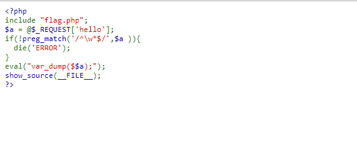
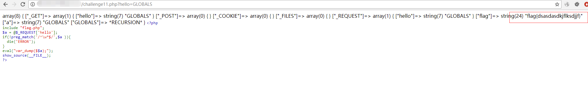

## 【题解】

**注：** 这里环境里的flag是自己输入的随机字符，所以不用考虑最后flag和答案不一致的问题

1.打开自己电脑中的浏览器，访问靶机开放的环境地址`http://IP:PORT/`来进行访问实验环境



2.我们可以直接看到php主要的逻辑代码：

```php
<?php
include "flag.php";
$a = @$_REQUEST['hello'];
if(!preg_match('/^\w*$/',$a )){
  die('ERROR');
}
eval("var_dump($$a);");
show_source(__FILE__);
?>
```

3.我们可以看到题目这里使用了` preg_match('/^\w*$/',$a ) `进行正则匹配，要求hello的输入必须为数字和字母的组合。 接下来执行了` eval("var_dump($$a);"); `，但由于过滤了符号无法正常闭合，所以不能通过闭合`var_dump()`来达到命令执行。

注意`var_dump`里为`$$a`，可以输出对应的变量的值，但你并不知道flag对应的变量名，若是简单的爆破那就是无头苍蝇。

php中有一个特殊的变量：[$GLOBALS](http://www.php.net/manual/zh/reserved.variables.globals.php "http://www.php.net/manual/zh/reserved.variables.globals.php")，它引用全局作用域中可用的全部变量。

4.所以payload为：

```php
challenge11.php?hello=GLOBALS
```



