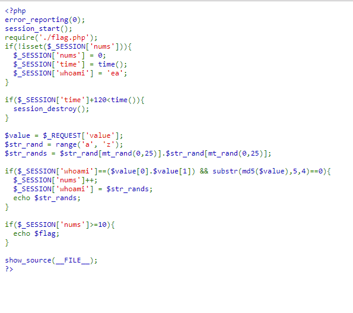
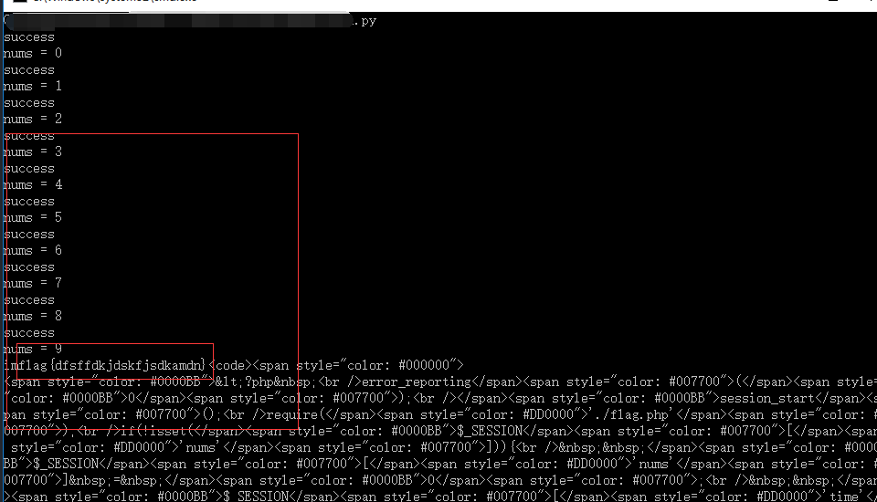

## 【题解】

**注：** 这里环境里的flag是自己输入的随机字符，所以不用考虑最后flag和答案不一致的问题

1.打开自己电脑中的浏览器，访问靶机开放的环境地址`http://IP:PORT/`来进行访问实验环境



2.我们可以直接看到php主要的逻辑代码：

```php
<?php
error_reporting(0);
session_start();
require('./flag.php');
if(!isset($_SESSION['nums'])){
  $_SESSION['nums'] = 0;
  $_SESSION['time'] = time();
  $_SESSION['whoami'] = 'ea';
}

if($_SESSION['time']+120<time()){
  session_destroy();
}

$value = $_REQUEST['value'];
$str_rand = range('a', 'z');
$str_rands = $str_rand[mt_rand(0,25)].$str_rand[mt_rand(0,25)];

if($_SESSION['whoami']==($value[0].$value[1]) && substr(md5($value),5,4)==0){
  $_SESSION['nums']++;
  $_SESSION['whoami'] = $str_rands;
  echo $str_rands;
}

if($_SESSION['nums']>=10){
  echo $flag;
}

show_source(__FILE__);
?>
```

3.我们可以看到这次题目要想得到`flag`需要`session`的`nums`值大于等于10，只有当`value`参数的前两位等于`whoami`的值并且`value`参数`MD5`加密后的值的5-9位都要是0才能让`nums`加1，`nums`初始为0，`session`超时时间为`120s`，除了第一次以外每次请求都会得到下一次的`whoami`。因此可以得到爆破思路：根据得到的`whoami`值爆破得到`md5`加密后5-9位都为0的`value`值并提交得到下一个`whoami`值，直到10次以后输出flag。

4.python脚本如下：

```python
import requests
import hashlib
import random

def get_value(given):
	global dict_az
	for i in range(1000000):
		result = given
		result += random.choice(dict_az)
		result += random.choice(dict_az)
		result += random.choice(dict_az)
		result += random.choice(dict_az)
		result += random.choice(dict_az)
		result += random.choice(dict_az)
		m = hashlib.md5(result)
		m = m.hexdigest()
		if m[5:9] == "0000":
			print "success"
			return result
		else:
			pass


def main(url_s):
	session = requests.Session()
	result = "ea"
	for i in range(10):
		url = url_s
		resp = session.get(url+result)
		the_page = resp.text
		result = get_value(the_page[0:2])
		print "nums = %d" % i
	print the_page


if __name__ == "__main__":
	dict_az = "abcdefghijklmnopqrstuvwxyz"
	url = "http://IP:PORT/challenge13.php?value="
	main(url)
```

**注：这里的ip和port替换成实验场景中的相应ip和port**

5.执行python脚本获得flag：


