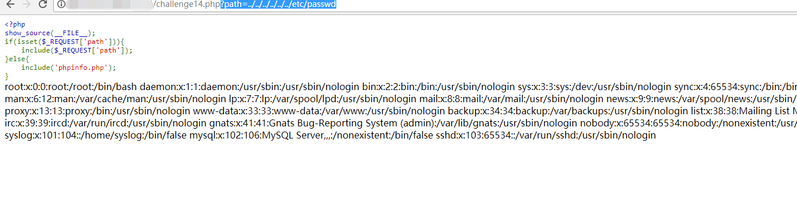
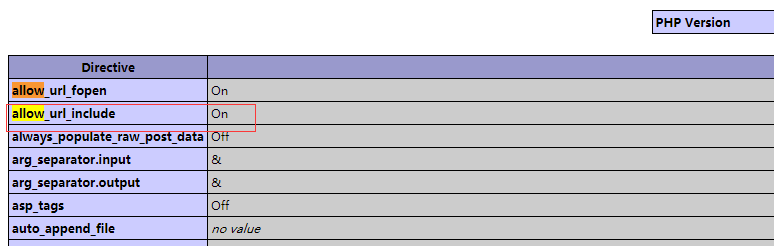
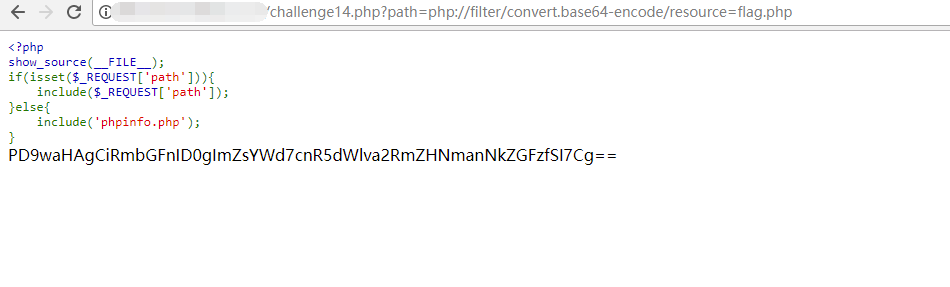
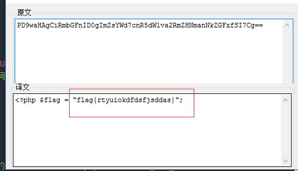

## 【题解】

**注：** 这里环境里的flag是自己输入的随机字符，所以不用考虑最后flag和答案不一致的问题

1.打开自己电脑中的浏览器，访问靶机开放的环境地址`http://IP:PORT/`来进行访问实验环境


2.我们可以直接看到php主要的逻辑代码：

```php
<?php
show_source(__FILE__);
if(isset($_REQUEST['path'])){
    include($_REQUEST['path']);
}else{
    include('phpinfo.php');
}
```

3.我们可以看到代码中直接通过`$_REQUEST`获取path的值，并且没有经过任何过滤直接调用`include()`函数进行文件包含，很明显存在文件包含漏洞。我们尝试利用payload：`?path=../../../../../../etc/passwd`看能否读取到`/etc/passwd`文件



成功读取。

4.我们看到页面首页中显示了phpinfo的信息，我们可以找到php配置:`allow_url_include=On`所以我们可以直接利用`php://filter` 读取文件信息。



5.利用payload读取flag.php：

`?path=php://filter/convert.base64-encode/resource=flag.php`



6.base64解码后得到flag：



