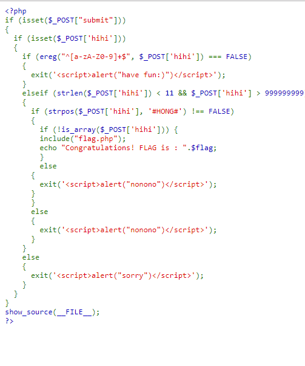
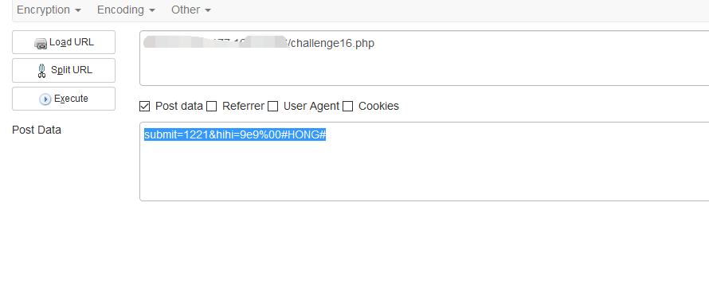
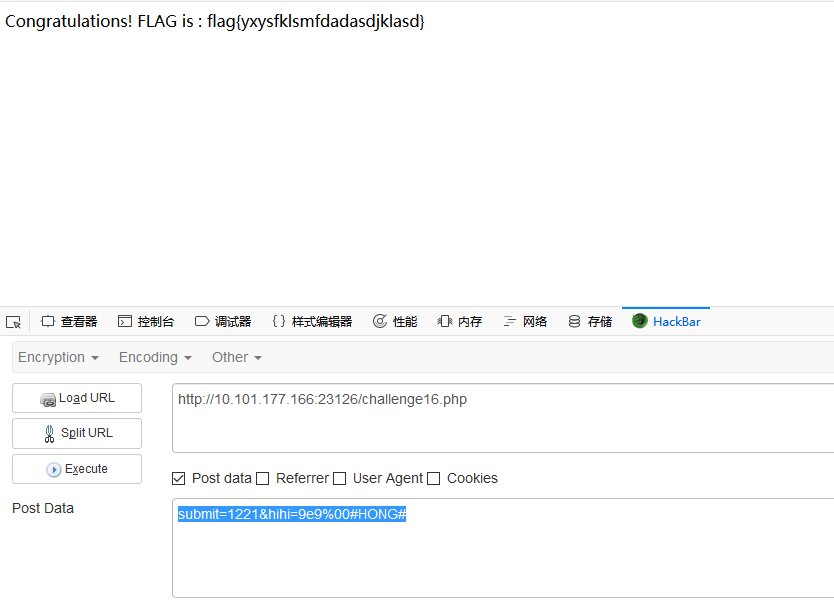

## 【题解】

**注：** 这里环境里的flag是自己输入的随机字符，所以不用考虑最后flag和答案不一致的问题

1.打开自己电脑中的浏览器，访问靶机开放的环境地址`http://IP:PORT/`来进行访问实验环境



2.我们可以直接看到php主要的逻辑代码：

```php
<?php  
if (isset($_POST["submit"]))  
{
  if (isset($_POST['hihi']))
  {
    if (ereg("^[a-zA-Z0-9]+$", $_POST['hihi']) === FALSE)
    {
      exit('<script>alert("have fun:)")</script>');
    }
    elseif (strlen($_POST['hihi']) < 11 && $_POST['hihi'] > 999999999)
    {
      if (strpos($_POST['hihi'], '#HONG#') !== FALSE)
      {
        if (!is_array($_POST['hihi'])) {
        include("flag.php");
        echo "Congratulations! FLAG is : ".$flag;
        }
        else
      {
        exit('<script>alert("nonono")</script>');
      }
      }
      else
      {
        exit('<script>alert("nonono")</script>');
      }
    }
    else
    {
      exit('<script>alert("sorry")</script>');
    }
  }
}
show_source(__FILE__);
?>
```

3.根据正则表达式，构造绕过拿到flag:

payload:

`POST :  submit=1221&hihi=9e9%00#HONG#`




4.获取flag：



