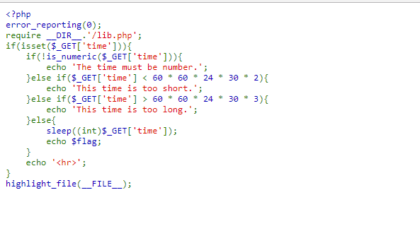
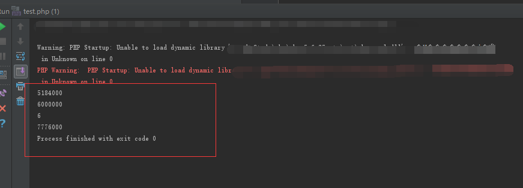
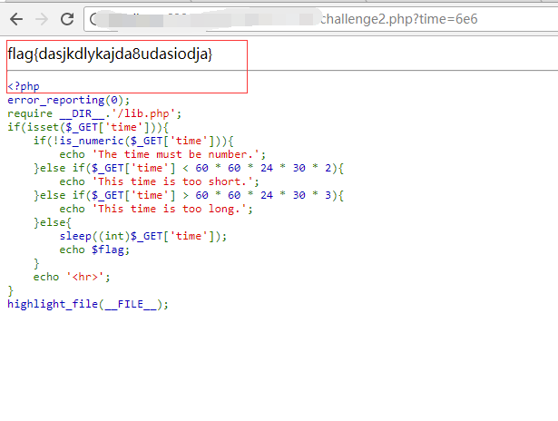

## 【题解】

**注：** 这里环境里的flag是自己输入的随机字符，所以不用考虑最后flag和答案不一致的问题

1.打开自己电脑中的浏览器，访问靶机开放的环境地址`http://IP:PORT/`来进行访问实验环境



2.可见我们输入一个介于5184000~7776000直接的值即可拿到flag。要是传入普通的数字比如 5184001 ，固然能过掉前两个if判断，但sleep函数就要让你等到天荒地老了，显然不可取这里选择弱比较。

```php
<?php
echo 60 * 60 * 24 * 30 * 2;
echo "\n";
echo 6e6;
echo "\n";
echo (int)'6e6';
echo "\n";
echo 60 * 60 * 24 * 30 * 3;
```

可以看以上脚本输出内容:

```php
5184000
6000000
6
7776000
```



3.故此访问[http://IP:PORT?time=6e6](http://IP:PORT?time=6e6 "http://IP:PORT?time=6e6")，等待6秒，即可拿到flag：



