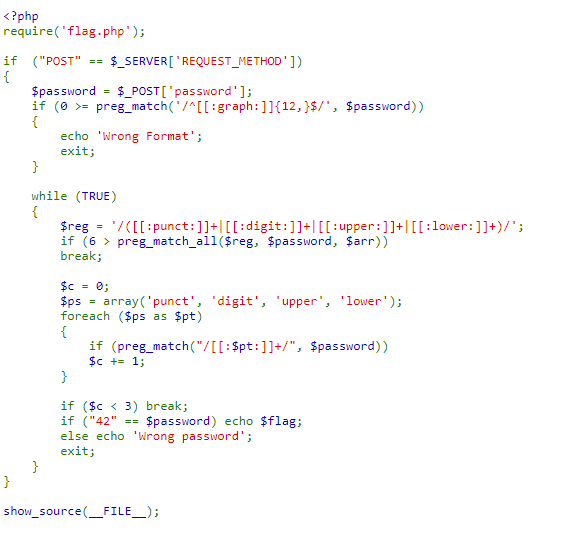
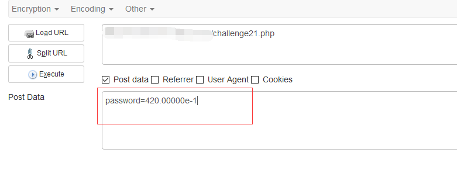
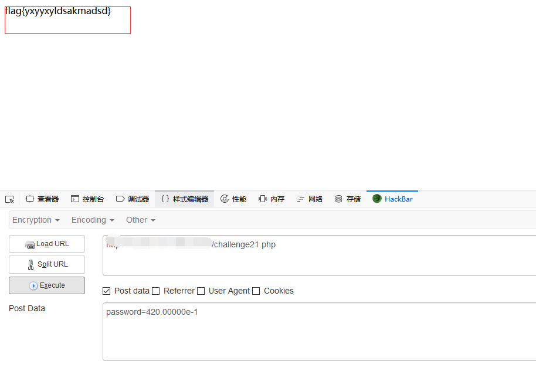

## 【题解】

**注：** 这里环境里的flag是自己输入的随机字符，所以不用考虑最后flag和答案不一致的问题

1.打开自己电脑中的浏览器，访问靶机开放的环境地址`http://IP:PORT/`来进行访问实验环境



2.我们可以直接看到php主要逻辑代码：

```php
<?php
require('flag.php');

if  ("POST" == $_SERVER['REQUEST_METHOD'])
{
    $password = $_POST['password'];
    if (0 >= preg_match('/^[[:graph:]]{12,}$/', $password))
    {
        echo 'Wrong Format';
        exit;
    }

    while (TRUE)
    {
        $reg = '/([[:punct:]]+|[[:digit:]]+|[[:upper:]]+|[[:lower:]]+)/';
        if (6 > preg_match_all($reg, $password, $arr))
        break;

        $c = 0;
        $ps = array('punct', 'digit', 'upper', 'lower');
        foreach ($ps as $pt)
        {
            if (preg_match("/[[:$pt:]]+/", $password))
            $c += 1;
        }

        if ($c < 3) break;
        if ("42" == $password) echo $flag;
        else echo 'Wrong password';
        exit;
    }
}

show_source(__FILE__);
```

3.题目分析

从代码上可以看出来，用户的输入需要先经过三个正则判断，最后符合`$password=="42"`，才能拿到FLAG。

三个正则比较简单，就不细说了，分别是：

1. 可见字符超过12个
2. 字符串中，把连续的大写，小写，数字，符号作为一段，至少分六段，例如a12SD+io8可以分成a 12 SD + io 8六段
3. 大写，小写，数字，符号这四种类型至少要出现三种

符合这三个要求的字符串很容易构建，关键是最后还要使`$password=="42"`。

要让一个字符串等于42，我首先想到的是16进制。

试一下

`var_dump("42"=="0x2A");`

输出为`bool(true)`。而且`0x2A`已经符合了正则3，要让它符合正则1也很容易，在前面补0就可以了。例如`0x000000002A`。但是正则2就不太好办了，在16进制前后加符号和小数点都会破坏在判断相等时进行的转换。

找出PHP Manual，重新读一下里面的`Comparison Operators`一章，看看PHP在判断相等的时候会做什么转换。结果在第一个例子中就看到答案了。

```php
var_dump("1" == "01"); // 1 == 1 -> true
var_dump("10" == "1e1"); // 10 == 10 -> true
var_dump(100 == "1e2"); // 100 == 100 -> true
```
在这题里既可以用4.2e1也可以用420e-1，不过第二种可以额外提供一个-符号，在第二个里加上小数点，`420.0e-1`，就满足正则2和正则3了。为了满足正则1，在里面再加几个零，就是我最后的答案：

`420.00000e-1`

4.构造payload：



5.获取flag：


