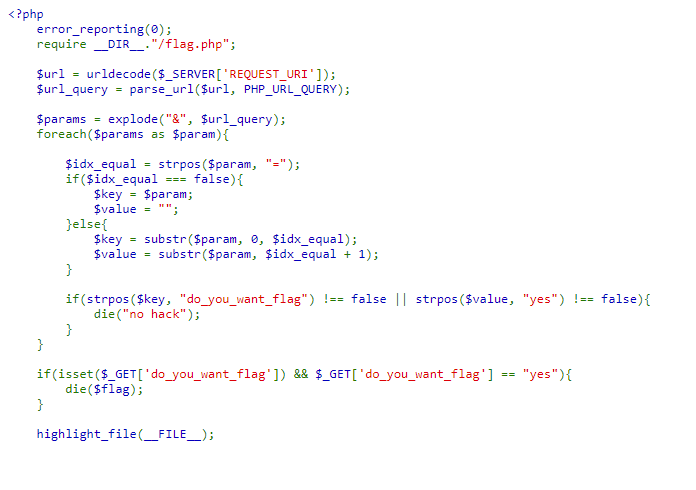
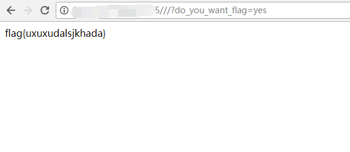

## 【题解】

**注：** 这里环境里的flag是自己输入的随机字符，所以不用考虑最后flag和答案不一致的问题

1.打开自己电脑中的浏览器，访问靶机开放的环境地址`http://IP:PORT/`来进行访问实验环境



2.我们点击`Source Code`可以直接看到php主要逻辑代码：

```php
<?php
    error_reporting(0);
    require __DIR__."/flag.php";

    $url = urldecode($_SERVER['REQUEST_URI']);
    $url_query = parse_url($url, PHP_URL_QUERY);

    $params = explode("&", $url_query);
    foreach($params as $param){

        $idx_equal = strpos($param, "=");
        if($idx_equal === false){
            $key = $param;
            $value = "";
        }else{
            $key = substr($param, 0, $idx_equal);
            $value = substr($param, $idx_equal + 1);
        }

        if(strpos($key, "do_you_want_flag") !== false || strpos($value, "yes") !== false){
            die("no hack");
        }
    }

    if(isset($_GET['do_you_want_flag']) && $_GET['do_you_want_flag'] == "yes"){
        die($flag);
    }

    highlight_file(__FILE__);
```

3.看到过滤

```php
if(strpos($key, "do_you_want_flag") !== false || strpos($value, "yes") !== false){
            die("no hack");
        }
```
但是题目却要求我们使用`do_you_want_flag=yes`来获取flag显然相互矛盾，我们寻找漏洞点，发现url的解析工作有由`parse_url()`操作此时相当`parse_url`一个解析漏洞，详情可以戳我的这篇文章:

[http://skysec.top/2017/12/15/parse-url%E5%87%BD%E6%95%B0%E5%B0%8F%E8%AE%B0/](http://skysec.top/2017/12/15/parse-url%E5%87%BD%E6%95%B0%E5%B0%8F%E8%AE%B0/ "http://skysec.top/2017/12/15/parse-url%E5%87%BD%E6%95%B0%E5%B0%8F%E8%AE%B0/")

4.所以我最后的bypass payload为:

```php
http://IP:PORT///?do_you_want_flag=yes
```


