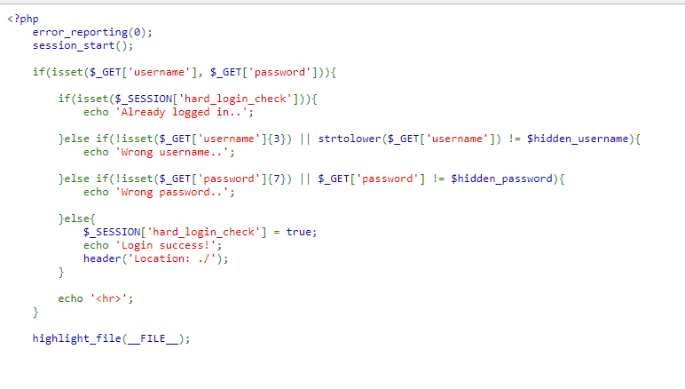
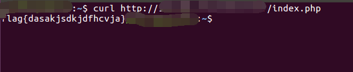

## 【题解】

**注：** 这里环境里的flag是自己输入的随机字符，所以不用考虑最后flag和答案不一致的问题

1.打开自己电脑中的浏览器，访问靶机开放的环境地址`http://IP:PORT/`来进行访问实验环境



2.我们可以直接看到php主要逻辑代码：

```php
<?php
    error_reporting(0);
    session_start();

    if(isset($_GET['username'], $_GET['password'])){

        if(isset($_SESSION['hard_login_check'])){
            echo 'Already logged in..';

        }else if(!isset($_GET['username']{3}) || strtolower($_GET['username']) != $hidden_username){
            echo 'Wrong username..';

        }else if(!isset($_GET['password']{7}) || $_GET['password'] != $hidden_password){
            echo 'Wrong password..';

        }else{
            $_SESSION['hard_login_check'] = true;
            echo 'Login success!';
            header('Location: ./');
        }

        echo '<hr>';
    }

    highlight_file(__FILE__);
```

3.我们可以看到我们访问的url自动跳转到login.php：

```url
http://IP:PORT/login.php
```

4.同时我们通过代码审计看到：

```url
  header('Location: ./');
```

尝试访问`http://IP:PORT/index.php`,发现页面还是跳转到了login.php,

5.通过curl访问：

`curl http://IP:PORT/index.php`

成功获取flag：



