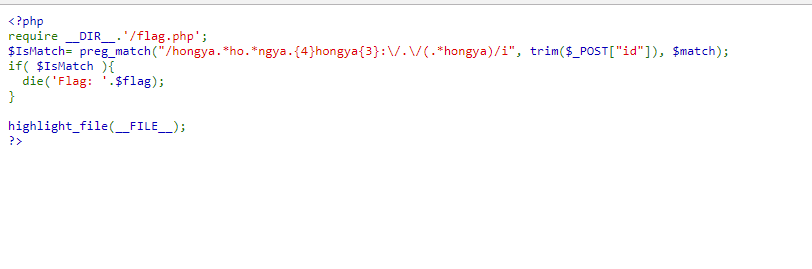
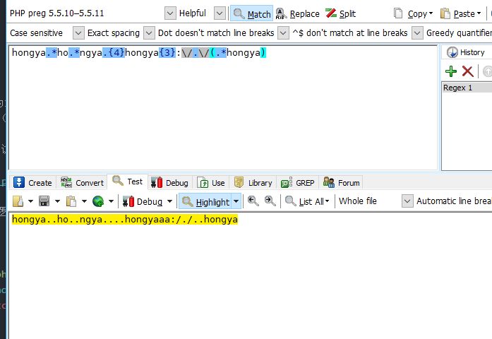
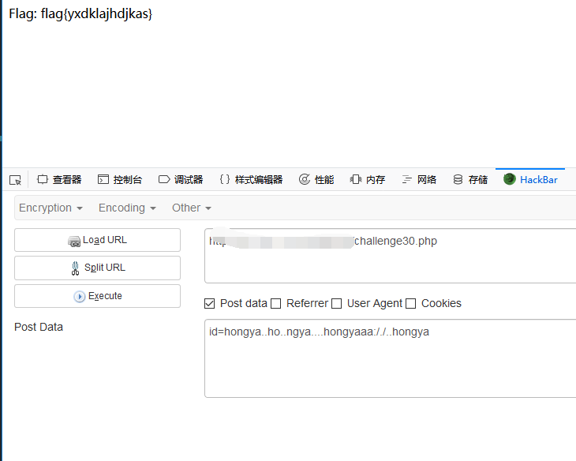

## 【题解】

**注：** 这里环境里的flag是自己输入的随机字符，所以不用考虑最后flag和答案不一致的问题

1.打开自己电脑中的浏览器，访问靶机开放的环境地址`http://IP:PORT/`来进行访问实验环境



2.我们可以直接看到php主要逻辑代码：

```php
<?php
require __DIR__.'/flag.php';
$IsMatch= preg_match("/hongya.*ho.*ngya.{4}hongya{3}:\/.\/(.*hongya)/i", trim($_POST["id"]), $match);
if( $IsMatch ){  
  die('Flag: '.$flag);
}

highlight_file(__FILE__);
?>
```

3.我们可以看到这一题主要就是匹配`hongya.*ho.*ngya.{4}hongya{3}:\/.\/(.*hongya)`这个正则表达式。

4.尝试构造payload:

`hongya..ho..ngya....hongyaaa:/./..hongya`

发现可以正常匹配正则



5.构造参数获取flag：



